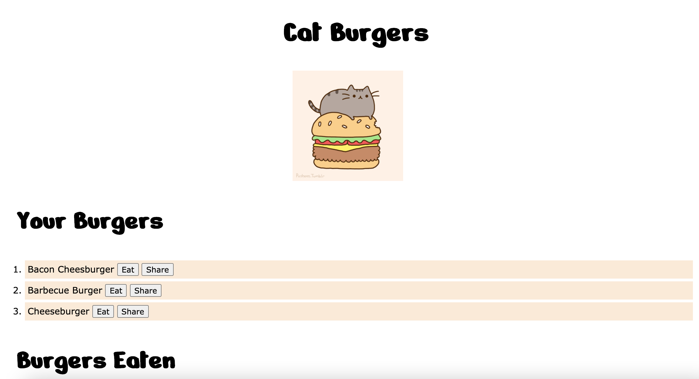
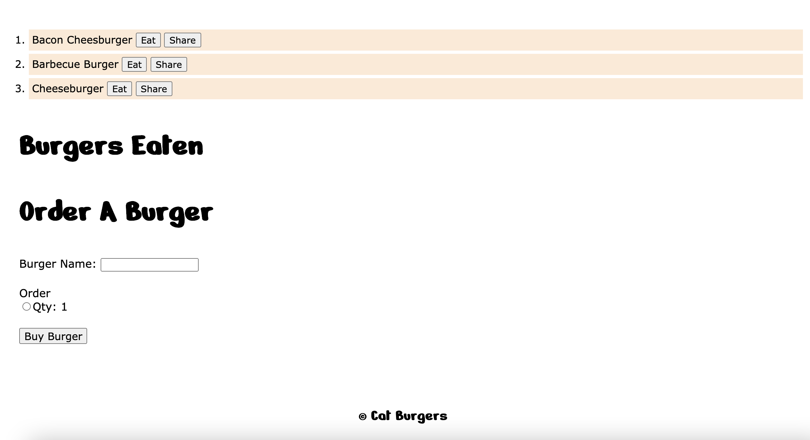

# Cat-Burgers

Welcome to Cat Burgers! Come enjoy the best burger in town. Cats are welcome :)

## Project Details

Welcome to Cat Burgers!

Ready to place your order? This full-stack application will let you buy burgers, eat them, share them with friends, and delete them. It was created using a MySql database, Heroku, JawsDB, Express Server, JavaScript and other modern technologies. The database is connected with MySql and JawsDB so that customers can view past and present burgers ordered and eaten. Orders are displayed live on the server for your viewing and taste bud satisfaction.

Thanks for stopping in! I look forward to working together to make the present and future a better place.

## Application

Cat Burgers: https://cat-burgers-mw.herokuapp.com/

## Build Details

This application was developed using: MySql, Node.js, Heroku, JawsDB, Express, Handlebars, JavaScript, ORM's, Controllers, HTML, CSS, and more!

## Repository & Preview

View the repository at: https://github.com/MichaelWitt/Cat-Burgers

Preview: 
Demo: 

## Updates

You can find project updates in the repository, highlighting what was done to create the final product.

https://github.com/MichaelWitt/Cat-Burgers/commits/

## Credits

UNC Coding Bootcamp And Trilogy for the inspiration!

KuliRam from Tenor.com for the Cat Burger gif.

Thanks!

## Thanks For Visiting!

Come back soon :)
